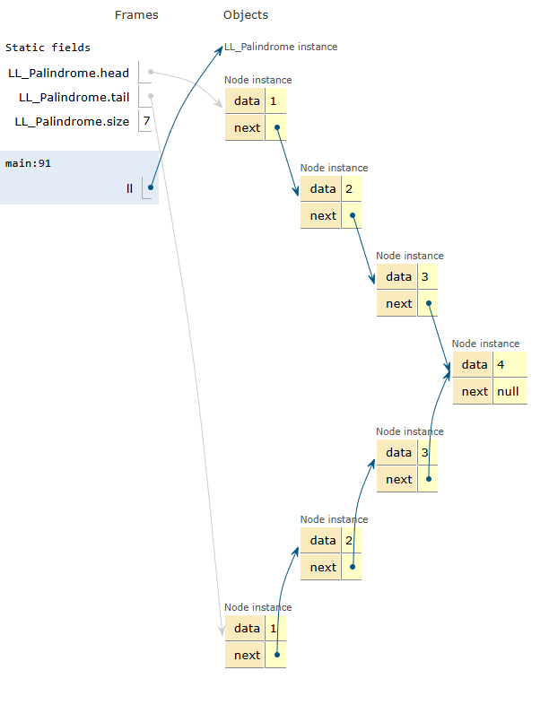

# Linked List Palindrome Check

## Overview
This document explains how to check whether a singly linked list is a **palindrome**.

---

## Problem Statement
Given a singly linked list, determine if the sequence of node values reads the same **forwards and backwards**—i.e., it is a *palindrome*.

Example:
```
1 -> 2 -> 3 -> 2 -> 1    ✅ Palindrome
1 -> 2 -> 3 -> 4         ❌ Not a Palindrome
```

---

## Key Idea
Use fast–slow pointers to find the middle, **reverse the second half** of the list, and compare the two halves.

---

## Steps

### 1️⃣ Find the Middle
Use two pointers:
- **slow** → moves 1 node per step
- **fast** → moves 2 nodes per step

When `fast` reaches the end, `slow` is at the middle.

### 2️⃣ Reverse the Second Half
Reverse the list starting from the middle node onward.

### 3️⃣ Compare Halves
Compare values of the first half and the reversed second half node by node.

### 4️⃣ (Optional) Restore List
Reverse the second half again to restore the original list if needed.

---


## Complexity
- **Time:** O(n)
- **Space:** O(1)

---

## Visualization


---

## Summary Flow
1. Find middle of the list.
2. Reverse second half.
3. Compare first half and reversed second half.
4. Return true if all match, otherwise false.
